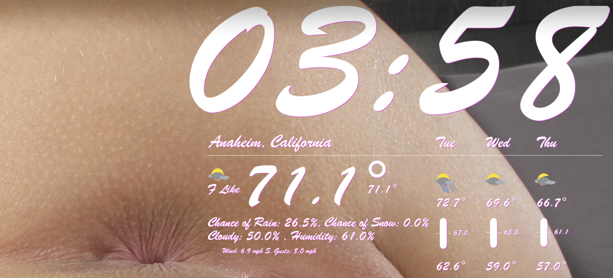

# jWeather
## Simple weather script built with weatherapi.com

## License
[](LICENSE)

## Why
Forecast.io died and I needed a weather monitor replacement. 

## Thanks
This project is based on: https://github.com/nickroberts/geektool-forecast.io-weather

## Requirements
PHP, GeekTool, WeatherAPI account (yes, it is free)

## How
Note:
- Requires GeekTool, which can be downloaded from https://www.tynsoe.org/geektool/
- Requires a weather API key from https://www.weatherapi.com/

- Register App for use at weatherapi.com
- Generate your API key
- Paste your API key and other configs into a `.env` file in the root of this project:
```
# Weather Options
WEATHERAPI_KEY="xxxxxxxxxxxx"
IMAGE_DIRECTORY="images"
DAYS_TO_FETCH=3
FONT_FAMILY="fonts/fontx.lel"
FONT_COLOR="#c64fff"
FONT_SIZE=35
# c or f
HEAT_UNIT="f"
# kpm or mph
SPEED_UNIT="mph"
PRECISION=1
LATITUDE="xxxxxxxxx"
LONGITUDE="yyyyyyyy"
TIME_ZONE="America/Los_Angeles"
APP_LOCALE=en
DEMO_SESH=false
```

- Open GeekTool

#### Enable Weather Generation Method 1
- Drag new 'Shell' Geeklet to your desktop
- Paste the following line into the Shell Command:
`/path/to/php /path/to/jWeather/artisan weather:generate-image`

Notes:
- The following command can show you the path to your php install:
`which php`
- You can disable the output by checking override text and setting the value to a space in GT

- Set the command to run every 60 seconds
- Set Timeout to something such as 20 seconds
- Check Display status feedback image
- In your terminal, run `/path/to/php /path/to/jWeather/artisan weather:generate-image` to generate the weather display, if necessary or to test

#### Enable Weather Generation Method 2 ( optional )
Note:
- This only applies if you chose to not do method 1

- Create a cron entry in your system for the weather script to run:
- In your terminal, run `crontab -e`
- Paste the following into your crontab:
- `0 * * * * /path/to/php /path/to/jWeather/artisan weather:generate-image`

#### Enable Weather Display
- Drag new 'Image' Geeklet to your desktop
- Set local path to: `/path/to/jWeather/public/images/weather.png`

- Resize the 'Image' window to desired size by dragging the bottom right corner
- Set to run every every 60 seconds

#### Enable Clock Display
- Drag new 'Image' Geeklet to your desktop
- Set local path to: `/path/to/jWeather/public/images/clock.png`

- Resize the 'Image' window to desired size by dragging the bottom right corner
- Set to run every every 60 seconds
- At this point, you should be set!

## Platforms
Any Mac system that has php installed

## FAQ
- You can change size of font in your `.env`, along with other settings
- The reason this project requires MacOS is because I'm not aware of another way besides GeekTool to easily place an image on your desktop in a certain position. You could technically try alternatives to solve this, as I'm sure they exist
- You may need to run `/path/to/php /path/to/jWeather/artisan weather:generate-image` to see those changes immediately
- The free WeatherAPI.com plan has a limit of 1,000 API calls per day and 100 calls per minute. For higher usage, you can upgrade to a production or enterprise key, which offers more advanced usage management

## Tests
`cd /path/to/jWeather && php artisan test --filter GenerateWeatherImageTest`

## Issues
https://github.com/jadissa/jWeather/issues
- If the weather API ever stops working, weather.gov currently provides a free service and this code could be updated to support that API instead: https://api.weather.gov/
- If you need to update laravel: `cd /path/to/jWeather/ && composer update`

## Screenshots
<p float="left">
  
</p>