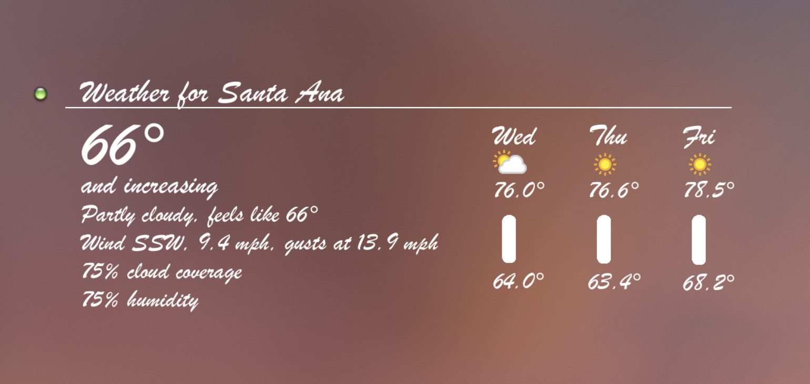
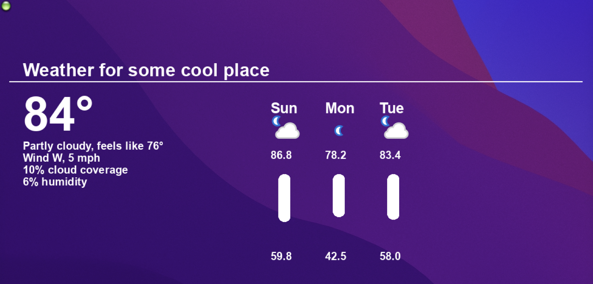
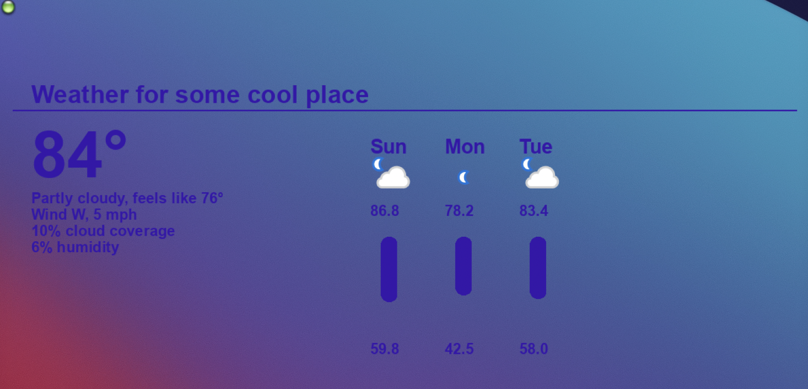
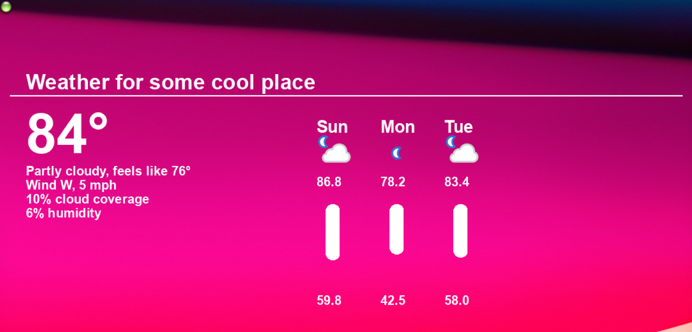

# jWeather
## Simple weather script built with weatherapi.com

## License
[](LICENSE)

## Why
Forecast.io died and I needed a weather monitor replacement

## How
- Register App for use at weatherapi.com
- Generate your API key
- Paste your API key into the weather.php script $OPTIONS, near the top
- Create a cron entry in your system for the weather script to run:
- # Runs every hour
- 0 * * * * php /path/to/jWeather/weather.php

- Open GeekTool
- Drag new 'Image' Geeklet to desktop
- Set local path to: /path/to/jWeather/out.png
- run ```cd /path/to/jWeather/ && /path/to/jWeather/./run.sh``` to generate out.png, if necessary
- Resize the 'Image' window to desired size by dragging the bottom right corner
- Set to run every every 2 seconds or no more than 3600 seconds
- At this point, you should be set!

## Platforms
Any Mac system that has php installed

## FAQ
- You can change size of font in weather.php, along with other settings
- You may need to run /path/to/jWeather/./run.sh to see those changes immediately

## Issues
https://github.com/jadissa/jWeather/issues

## Screenshots
<p float="left">
  
  
  
  
</p>