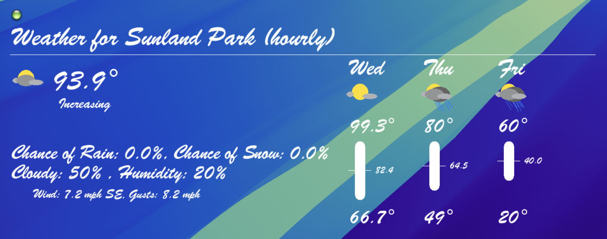

# <a href="https://www.weatherapi.com/" title="Free Weather API"></a>jWeather
## Simple weather script built with weatherapi.com

## License
[](LICENSE)

## Why
Forecast.io died and I needed a weather monitor replacement

## How
- Register App for use
- Visit weatherapi.com
- Generate your API key
- ```echo 'export WEATHER_KEY="API_KEY"' >>~/.bash_rc && source ~/.bash_rc```

- Open GeekTool
- Drag new 'Shell' Geeklet to desktop
- Paste into the shell window: /path/to/jWeather/./run.sh
- Set to run every 3600 seconds

- Drag new 'Image' Geeklet to desktop
- Set local path to: /path/to/jWeather/out.png
- run ```/path/to/jWeather/run.sh``` to generate out.png
- Resize the 'Image' window to desired size by dragging the bottom right corner
- Set to run every 3600 seconds or less

#### Notes
- You may need to add permissions so the script can run:
- ```chmod 775 /path/to/jWeather/run.sh```

- At this point, you should be set!

## Platforms
Any system that has php installed

## FAQ
- You can change size of font in weather.php, along with other settings
- You may need to run /path/to/jWeather/run.sh to see those changes immediately

## Issues
https://github.com/jadissa/jWeather/issues

## Screenshots
<p float="left">
  
  
  
  
</p>